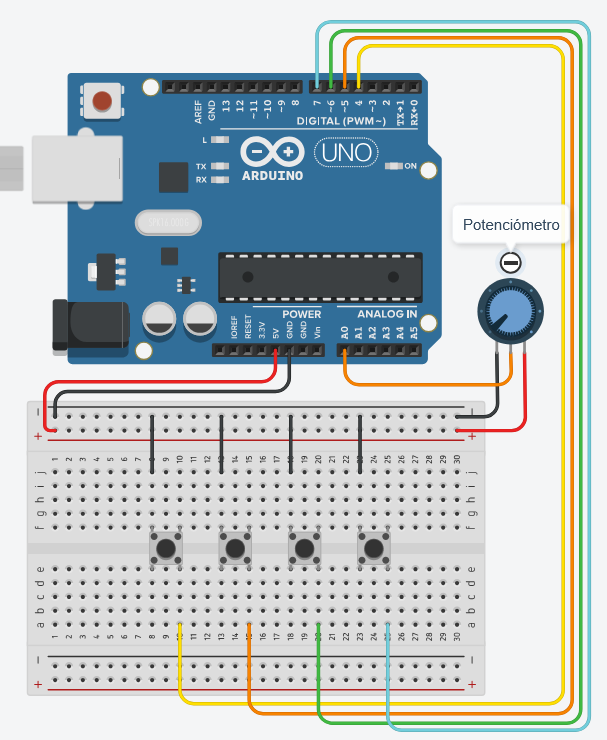

<!--
Convertido desde: Laboratorio_RealidadMixta_ExperienciaFisicoDigital-1.pdf
Documento original: 3 páginas, LaTeX (pdfTeX, clase IEEEtran), a dos columnas.
La Figura 1 se extrajo a: assets/figura-1-circuito.png
-->

**Facultad de Ingeniería**

# Experiencia Físico-Digital

**Ing. Sergio Alberto Reyes Gómez**

*Facultad de Ingeniería. Universidad San Buenaventura. Bogotá, Colombia.*

## 1. Objetivos

### 1.1. Objetivo general

Implementar y comparar experimentalmente distintos protocolos de comunicación entre un microcontrolador Arduino y un entorno interactivo desarrollado en Unity, analizando el flujo de información entre un controlador físico (hardware) y un simulador digital, con el fin de establecer criterios técnicos para la selección de un protocolo de transmisión de datos.

### 1.2. Objetivos específicos

- Diseñar e implementar un circuito utilizando un microcontrolador Arduino capaz de capturar señales provenientes de entradas digitales y analógicas.
- Investigar y aplicar estándares de construcción de paquetes de datos (*framing*), representación en formato JSON y métodos de verificación de integridad de la información transmitida.
- Desarrollar al menos tres implementaciones distintas de protocolo de comunicación serial entre Arduino y Unity, justificando su selección desde el marco teórico investigado.
- Conectar cada una de las implementaciones desarrolladas con un simulador interactivo asignado, evaluando su comportamiento bajo condiciones reales de uso.
- Comparar cuantitativa y cualitativamente las implementaciones desarrolladas en términos de latencia, legibilidad de los datos y demás criterios definidos por el propio grupo, obteniendo conclusiones aplicables al desarrollo del vehículo del curso.

## 2. Materiales Requeridos

- 1 Arduino Uno R3
- 1 Protoboard
- 4 Pulsadores
- 1 Potenciómetro de 1 kΩ
- Varios jumpers o cables para realizar las conexiones
- Equipo con Unity instalado (se recomienda la versión 6000.3.8f1)

## 3. Entregables

Cada grupo debe producir lo siguiente:

- **Construir el circuito** mostrado en la Figura 1, con los cuatro pulsadores y el potenciómetro.
- **Investigar los siguientes temas**, con evidencia consultable (fuentes citadas en el informe):
  - Estándares de construcción de paquetes de datos: estructuración por delimitador vs. por longitud fija, uso de encabezado (*header*) y las técnicas existentes para evitar que un byte del propio dato transmitido sea interpretado erróneamente como parte del formato del mensaje (*byte stuffing/escaping*).
  - JSON como formato de intercambio de datos, y su deserialización en C# dentro de Unity (`JsonUtility` frente a `Newtonsoft.Json`/Json.NET), incluyendo las limitaciones de cada opción.
  - Métodos de comprobación de integridad de datos: bit de paridad, *checksum* (suma módulo 256, XOR) y CRC, con sus respectivos costos computacionales y niveles de robustez.
- **Seleccionar tres implementaciones de protocolo de comunicación** a partir del siguiente menú de opciones (el grupo puede además proponer una variante propia, siempre que la justifique):
  - a) Texto plano delimitado (formato tipo CSV).
  - b) Representación en JSON transmitida sobre el canal serial.
  - c) Binario crudo, con encabezado, longitud y verificación de integridad.
  - d) Representación hexadecimal en ASCII del dato binario.
  - e) Formato Tipo-Longitud-Valor (TLV).
  - f) Codificación Base64 sobre el canal serial.
- **Desarrollar y verificar** las tres implementaciones seleccionadas: Realizar un sketch en Arduino para cada una, y el correspondiente script de deserialización (Recibir los datos y procesarlos en algo que se pueda usar) en Unity, confirmando que los tres métodos decodifican correctamente el mismo valor de prueba.
- **Conectar cada una de las tres implementaciones** con el simulador interactivo asignado (ver Anexo 5), verificando que el controlador físico (pulsadores y potenciómetro) responde correctamente dentro del simulador en los tres casos.
- **Definir y aplicar un procedimiento de medición propio** para capturar, como mínimo, latencia y legibilidad de los datos transmitidos por cada implementación. El grupo es libre de definir cómo mide cada criterio (por ejemplo: marca de tiempo de ida y vuelta, conteo de fotogramas en Unity, tamaño en bytes por mensaje, facilidad de depuración en el monitor serial), siempre que el procedimiento quede documentado con suficiente detalle en el informe para que sea reproducible.
- **Registrar evidencia** del funcionamiento de las tres implementaciones frente al simulador (capturas de pantalla, video corto o fotografías) y los datos crudos obtenidos.
- **Inicializar y mantener el repositorio en GitHub**, con una carpeta `Arduino` y una carpeta `Unity`, incluyendo un archivo `.gitignore` apropiado.
- **Elaborar el informe final**, cuya estructura se detalla en la Sección 4.

**Figura 1:** Circuito de señales digitales y analógicas

## 4. Informe final

El informe se entrega en formato IEEE según la plantilla proporcionada, con una extensión **máxima de 8 páginas**. Debe incluir las siguientes secciones:

1. **Resumen y abstract.**
2. **Introducción y objetivos.**
3. **Marco teórico.** Estándares de *framing*, JSON y su deserialización en C#; y métodos de comprobación de integridad investigados durante el trabajo autónomo, con las fuentes consultadas debidamente citadas.
4. **Metodología y desarrollo.** Descripción del circuito construido, las tres implementaciones seleccionadas con su justificación, el procedimiento de medición definido por el grupo, y el simulador asignado (nombre e identificación de por qué sus características particulares son relevantes para interpretar los resultados).
5. **Resultados.** Datos obtenidos para cada una de las tres implementaciones, presentados en al menos una tabla comparativa y una gráfica.
6. **Análisis y discusión.** Comparación entre las tres implementaciones a partir de los resultados obtenidos, contrastada con lo esperado según el marco teórico.
7. **Conclusiones.** Recomendación justificada de qué protocolo utilizaría el grupo para la siguiente etapa del vehículo del curso (Corte 2) y para el proyecto final, y por qué.
8. **Enlace al repositorio de GitHub.**

## 5. Criterios de evaluación

1. **Circuito y firmware base:** correcta lectura de las señales digitales (pulsadores) y analógicas (potenciómetro).
2. **Marco teórico:** profundidad y corrección de la investigación sobre *framing*, JSON/deserialización en C# y métodos de comprobación de integridad, con fuentes citadas apropiadamente.
3. **Implementaciones desarrolladas:** correcto funcionamiento de las tres implementaciones seleccionadas, calidad del manejo de integridad y, cuando aplique, del problema de *escaping* en datos binarios; pertinencia de la justificación de selección de las tres opciones.
4. **Funcionamiento frente al simulador:** verificación de que las tres implementaciones responden correctamente dentro del simulador asignado durante la sesión presencial.
5. **Rigor del procedimiento de medición:** claridad y reproducibilidad del procedimiento definido por el grupo para capturar latencia, legibilidad y demás criterios evaluados.
6. **Análisis comparativo y conclusiones:** calidad de la interpretación de los resultados obtenidos y pertinencia de la recomendación final para las siguientes etapas del curso.
7. **Informe y repositorio:** calidad del documento en formato IEEE dentro del límite de 8 páginas, y correcta estructuración y entrega del repositorio en GitHub.
8. **Calidad del simulador y diseño:** estabilidad y consistencia del comportamiento reflejado por el simulador, y claridad y coherencia del diseño visual empleado para representar dicho comportamiento.

## Anexo: simuladores asignados

El docente asigna a cada grupo uno de los siguientes cuatro simuladores desarrollados en Unity. Cada simulador exige un comportamiento distinto del canal de comunicación, lo cual debe tenerse en cuenta al interpretar y comparar los resultados obtenidos entre grupos.

- **S1) Plataformero 2D.** Movimiento lateral y salto controlados por pulsadores, velocidad de carrera mapeada al potenciómetro.
- **S2) Piloto de nave/dron.** Altitud/aceleración controlada de forma continua por el potenciómetro; pulsadores para disparo, impulso y cambio de modo.
- **S3) Juego de secuencias.** Los pulsadores ingresan una secuencia que debe reproducirse correctamente; el potenciómetro ajusta el tempo o la dificultad.
- **S4) Mezclador visual en tiempo real.** El potenciómetro controla simultáneamente varios parámetros visuales de actualización continua; los pulsadores cambian canal o efecto.
